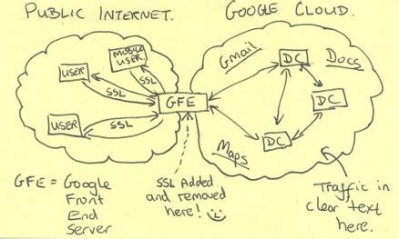
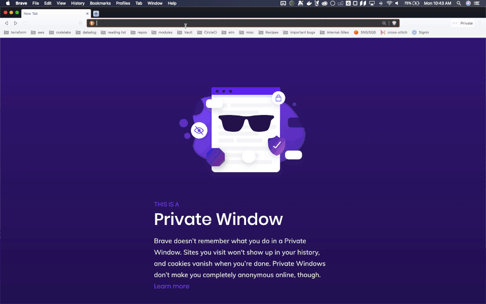

# Beyondcorp-Cloudfront

Lambda@Edge function to add Cognito authentication to CloudFront instances.

## What is BeyondCorp?

In 2013, during the Edward Snowden leaks to the Washington Post, this image from an NSA slide became public:



The picture shows an NSA employees depiction of Google's architecture (heavily simplified). At first glance, this picture doesn't show any serious flaw. The Google Cloud is in its own private network, so it should make sense that the data between servers could be in plaintext, right?

Unfortunately, this assumption is no longer a valid one to make. The NSA, under the MUSCULAR program, started physically capturing all data flowing between Google's data centers on their private fiber optic cables. Suddenly that plaintext data didn't seem like such a good idea, and Google became very angry.

They had a brilliant idea, one that they had already been working on for some time, but that could now solve their problem. What if all data flowing around their cloud (public or private) was encrypted? And what if they could move the permissions boundary from being at a network level (where anyone with a VPN can gain access) to a server level (where every single request could have it's own authentication requirements).

This gave birth to BeyondCorp, a set of principles that Google has expanded on [in a few whitepapers](beyondcorp.com).

## Demo

My goodness, BeyondCorp is filled with buzz words. It's zero trust. It's perimiterless. It's context-aware.

That sure is a lot of cool phrases. But what does it look like in real life? Well, let's see what happens when I go to Transcend's internal codelabs site, where we have set up BeyondCorp authentication with our company's GSuite credentials:



There's nothing really fancy or hard to understand here. When I go to the page for the first time in a day, I login with GSuite (and my Yubico MFA key). My login info is cached locally, and for the rest of the day I can browse internal sites without being asked to log in again.

## Getting Started

If you want to get started quickly with Terraform, you can use the module under `./terraform-module`:

```terraform
resource "aws_cognito_user_pool" "pool" {
  name = "some-user-pool-name"
}

resource "aws_cognito_user_pool_client" "client" {
  name                = "some-user-pool-client-name"
  user_pool_id        = aws_cognito_user_pool.pool.id
  generate_secret     = true
  allowed_oauth_flows = ["code"]
  callback_urls = ["https://your.frontend.url"]
  allowed_oauth_scopes                 = ["email", "openid"]
  allowed_oauth_flows_user_pool_client = true
  supported_identity_providers         = ["COGNITO"]
  explicit_auth_flows = [
    "ALLOW_CUSTOM_AUTH",
    "ALLOW_REFRESH_TOKEN_AUTH",
    "ALLOW_USER_SRP_AUTH",
  ]
}

resource "aws_cognito_user_pool_domain" "domain" {
  domain       = "some-subdomain-to-login-at"
  user_pool_id = aws_cognito_user_pool.pool.id
}

module "lambda_at_edge" {
  source = "git::git@github.com:transcend-io/beyondcorp-cloudfront//terraform-module?ref=0.0.3"

  userpool_id     = aws_cognito_user_pool.pool.id
  client_id       = aws_cognito_user_pool_client.client.id
  client_secret   = aws_cognito_user_pool_client.client.client_secret
  ui_subdomain    = aws_cognito_user_pool_domain.domain.domain
  scopes          = aws_cognito_user_pool_client.client.allowed_oauth_scopes
  userpool_region = "us-east-1"
}
```

And with that, you'll have a Lambda@Edge function ready to attach to any `Viewer-Request` CloudFront event you'd like.

For a complete walkthrough of using this module, checkout [our blog post](https://codelabs.transcend.io/codelabs/aws-beyondcorp/index.html)